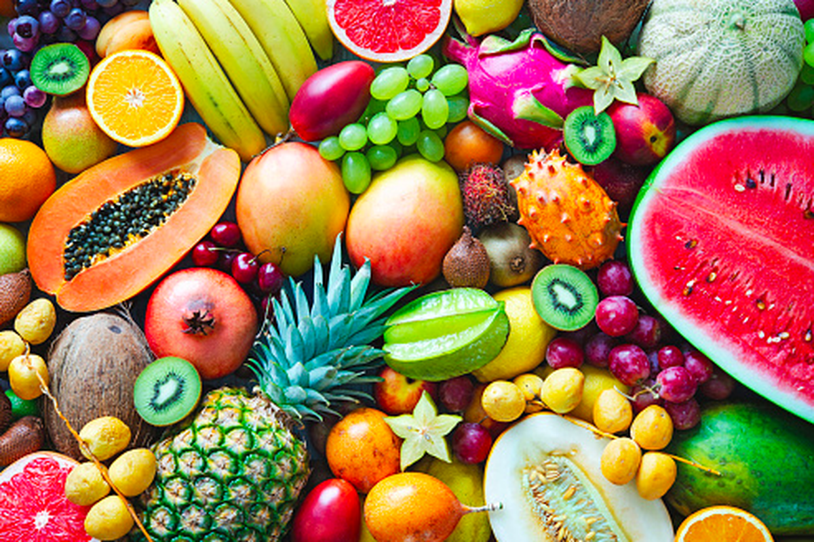
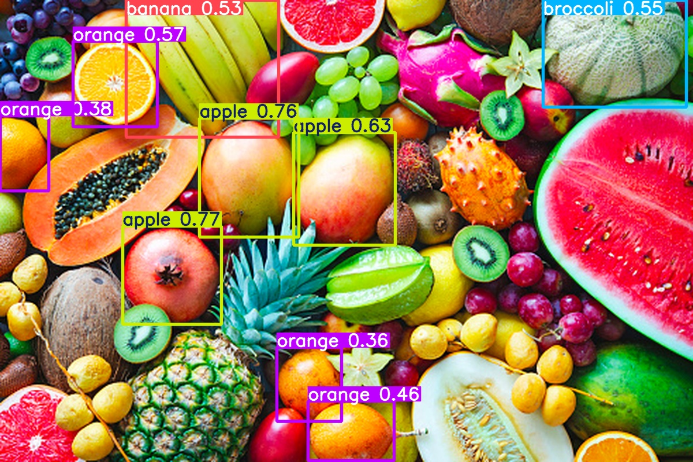

# Mini-Yolo

Mini-Yolo adalah implementasi lightweight dari YOLOv8 Nano untuk deteksi objek real-time. Proyek ini menggunakan model pre-trained YOLOv8n untuk melakukan inferensi cepat pada gambar.

## Fitur

- 🚀 Deteksi objek real-time menggunakan YOLOv8 Nano
- 📦 Model pre-trained yang siap digunakan
- 🎯 Akurasi tinggi dengan kecepatan inferensi optimal
- 📁 Output tersimpan otomatis di folder `runs/detect/predict/`

## Requirements

- Python 3.8+
- ultralytics
- OpenCV (cv2)
- Torch/TorchVision

## Instalasi

1. Clone repository ini:
```bash
git clone https://github.com/Rifaldo-dev/Mini-Yolo.git
cd Mini-Yolo
```

2. Install dependencies:
```bash
pip install ultralytics opencv-python torch torchvision
```

## Penggunaan

Jalankan deteksi objek pada gambar dengan perintah:

```bash
python main.py <path-to-image>
```

### Contoh:
```bash
python main.py image.jpg
python main.py ./sample_image.png
```

## Contoh Hasil Deteksi

### Sebelum Pemrosesan


### Sesudah Pemrosesan (Dengan Deteksi)


## Output

Hasil deteksi akan disimpan di:
```
runs/detect/predict/
├── image.jpg          # Gambar dengan bounding box dan deteksi
└── labels/           # File label untuk setiap deteksi (jika save_txt=True)
```

Untuk menyimpan file label dalam format TXT, gunakan perintah:
```bash
python main.py image.jpg --save-txt
```

## Model

**YOLOv8n (Nano)** - Model terkecil dari keluarga YOLOv8
- Size: ~6.3 MB
- Speed: ~80ms per gambar (CPU)
- Accuracy: 37.3% mAP50

File model: `yolov8n.pt`

## Struktur Project

```
Mini-Yolo/
├── main.py           # Script utama
├── yolov8n.pt        # Model pre-trained
├── README.md         # Dokumentasi ini
└── runs/
    └── detect/
        └── predict/  # Output deteksi
```

## Kelas Deteksi

Model YOLOv8n dapat mendeteksi 80 kelas objek COCO, termasuk:
- Person (Orang)
- Vehicle (Kendaraan: mobil, bus, motor, dll)
- Animal (Hewan: anjing, kucing, burung, dll)
- dan 77 kelas lainnya

## Troubleshooting

### Error: "No module named 'ultralytics'"
```bash
pip install ultralytics --upgrade
```

### Error: "CUDA out of memory"
Model akan otomatis beralih ke CPU jika GPU tidak tersedia

### Gambar tidak terdeteksi
- Pastikan path gambar benar
- Gunakan format yang didukung: JPG, PNG, BMP, GIF

## Lisensi

Proyek ini menggunakan YOLOv8 dari Ultralytics yang dilisensikan di bawah AGPL-3.0

## Kontribusi

Silakan buat issue atau pull request untuk perbaikan dan fitur baru.